# Base de datos: DuckDB construye, PostgreSQL sirve

El almacén de este proyecto vive en dos motores con el mismo modelo:

| | DuckDB | PostgreSQL |
|---|---|---|
| Papel | Construye y valida el almacén desde el Parquet | Sirve el almacén publicado |
| Dónde está | `data/warehouse/retail.duckdb` (un archivo de 38 MB) | Un servidor, configurado con `DATABASE_URL` |
| SQL | `sql/01..03` y `sql/marts/` | `sql/postgres/` (esquema, claves e índices) |
| Integridad | Validaciones al construir (`build_warehouse.py`) | Claves primarias, foráneas y `CHECK` en la propia base |
| Para qué | Clonar y ejecutar sin instalar nada | Uso real: varios usuarios, integridad garantizada |

El tablero usa PostgreSQL si `DATABASE_URL` está definida y DuckDB si no. Las imágenes de este documento son consultas reales **sobre PostgreSQL**, con el millón de líneas cargado (`src/publish_postgres.py`).

## Contenido

- [Esquema en estrella](#esquema-en-estrella)
- [Decisiones de diseño](#decisiones-de-diseño)
- [Cómo se publica en PostgreSQL](#cómo-se-publica-en-postgresql)
- [Consultas de ejemplo](#consultas-de-ejemplo)
- [Cómo reproducir las consultas](#cómo-reproducir-las-consultas)

## Esquema en estrella

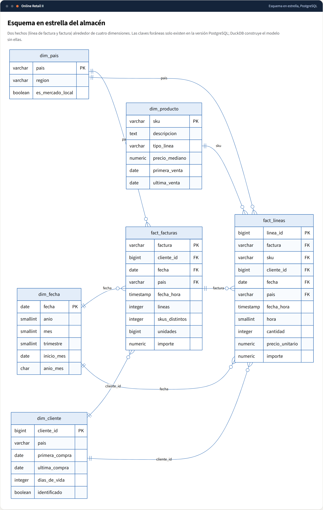

| Tabla | Grano | Filas |
|---|---|---|
| `core.fact_lineas` | Una línea de factura | 1.033.036 |
| `core.fact_facturas` | Una factura (cabecera) | 53.628 |
| `core.dim_fecha` | Un día del calendario, también los días sin ventas | 739 |
| `core.dim_cliente` | Un cliente (más el centinela `-1`) | 5.943 |
| `core.dim_producto` | Un SKU con su descripción canónica | 5.305 |
| `core.dim_pais` | Un país con su región | 43 |

El esquema `mart` guarda los cálculos publicados (KPIs, RFM, cohortes, cesta, traza de calidad...). El código Mermaid del diagrama está en [`database/er-estrella.mmd`](database/er-estrella.mmd).

## Decisiones de diseño

| Decisión | Por qué |
|---|---|
| **El hecho conserva todas las líneas** (ventas, devoluciones, ajustes, bajas de inventario) | Filtrar es responsabilidad de cada consulta. Si se borraran las devoluciones no se podría calcular la tasa de devolución. |
| **Cliente centinela `-1`** en vez de `NULL` | Un `JOIN` con `NULL` pierde filas en silencio. El `CHECK dim_cliente_centinela` garantiza que el `-1`, y solo él, es el cliente no identificado. |
| **`computa_ingreso` precalculado** | Una sola regla (producto o envío, precio positivo) decide qué cuenta como ingreso en todo el tablero. |
| **Claves foráneas solo en PostgreSQL** | DuckDB transforma por lotes y valida al final; PostgreSQL protege el dato en cada escritura. |
| **`CHECK` de reglas de negocio** | Una devolución siempre es una factura con prefijo `C`; `fecha` siempre coincide con el día de `fecha_hora`; la hora está entre 0 y 23. |
| **Importes `NUMERIC`** en PostgreSQL | Exactos, sin errores de coma flotante (DuckDB usa `DOUBLE`; la diferencia nunca supera un céntimo y el test lo comprueba). |
| **Índices creados después de cargar** | Construir un índice sobre la tabla ya llena es mucho más rápido que mantenerlo fila a fila durante el `COPY`. |
| **Índice parcial** `(cliente_id, fecha) WHERE cliente_id <> -1` | RFM y cohortes nunca miran las 235.000 líneas sin cliente: el índice no las incluye y ocupa menos. |
| **Desempate por `cliente_id` en los quintiles RFM** | `NTILE` sobre valores empatados asigna el quintil de forma arbitraria. Con el desempate, el segmento de cada cliente es el mismo en cada ejecución y en cada motor. |

## Cómo se publica en PostgreSQL

`src/publish_postgres.py` hace todo en **una transacción**:

1. Crea los esquemas `core` y `mart` con [`sql/postgres/01_esquema.sql`](../sql/postgres/01_esquema.sql).
2. Exporta cada tabla de DuckDB a CSV y la carga con `COPY` (el método más rápido de PostgreSQL), dimensiones primero y hechos después, para que las claves foráneas se cumplan.
3. Crea los índices con [`sql/postgres/02_indices.sql`](../sql/postgres/02_indices.sql) y actualiza las estadísticas (`ANALYZE`).
4. Valida que el recuento de filas de cada tabla y la facturación total coincidan con DuckDB. Si algo no cuadra, revierte todo.

## Consultas de ejemplo

Los archivos SQL están en [`database/queries/`](database/queries/).

### 1. Facturación mensual con media móvil
[`01-facturacion-mensual.sql`](database/queries/01-facturacion-mensual.sql): ventana `ROWS BETWEEN 2 PRECEDING AND CURRENT ROW` sobre el agregado.

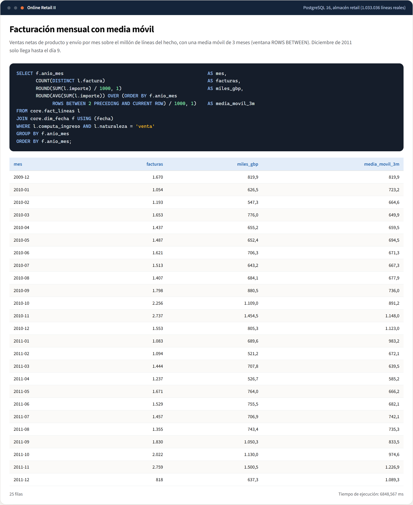

### 2. Traza de limpieza
[`02-traza-de-limpieza.sql`](database/queries/02-traza-de-limpieza.sql): `LAG` calcula cuántas filas quita cada etapa, incluido el solape entre hojas del Excel.

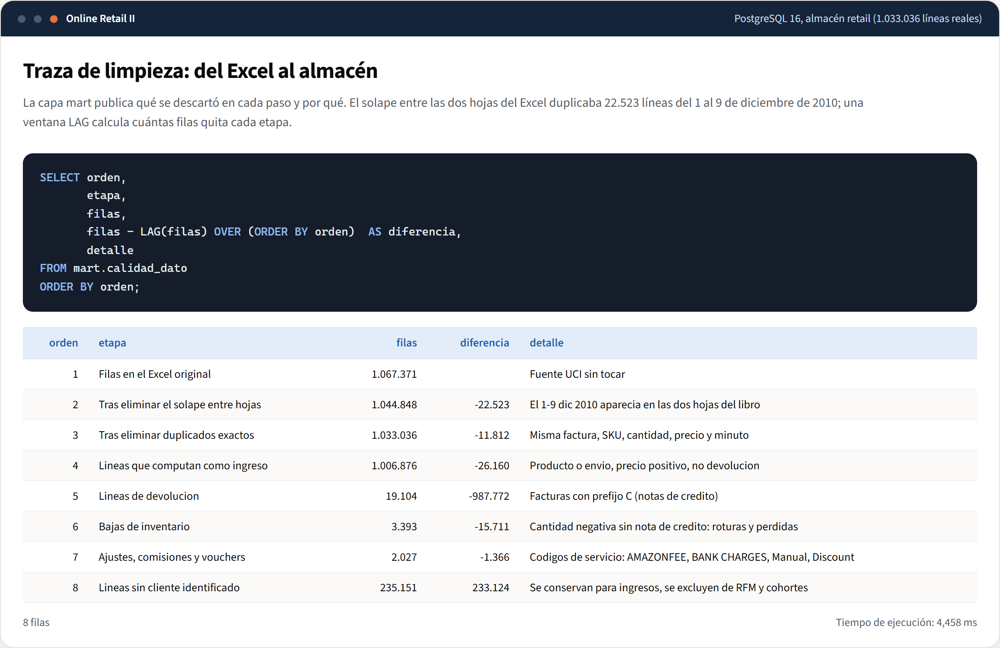

### 3. Pareto de clientes
[`03-pareto-de-clientes.sql`](database/queries/03-pareto-de-clientes.sql): `NTILE(10)` y una ventana acumulada: el primer decil de clientes genera el 63,8 % de la facturación.

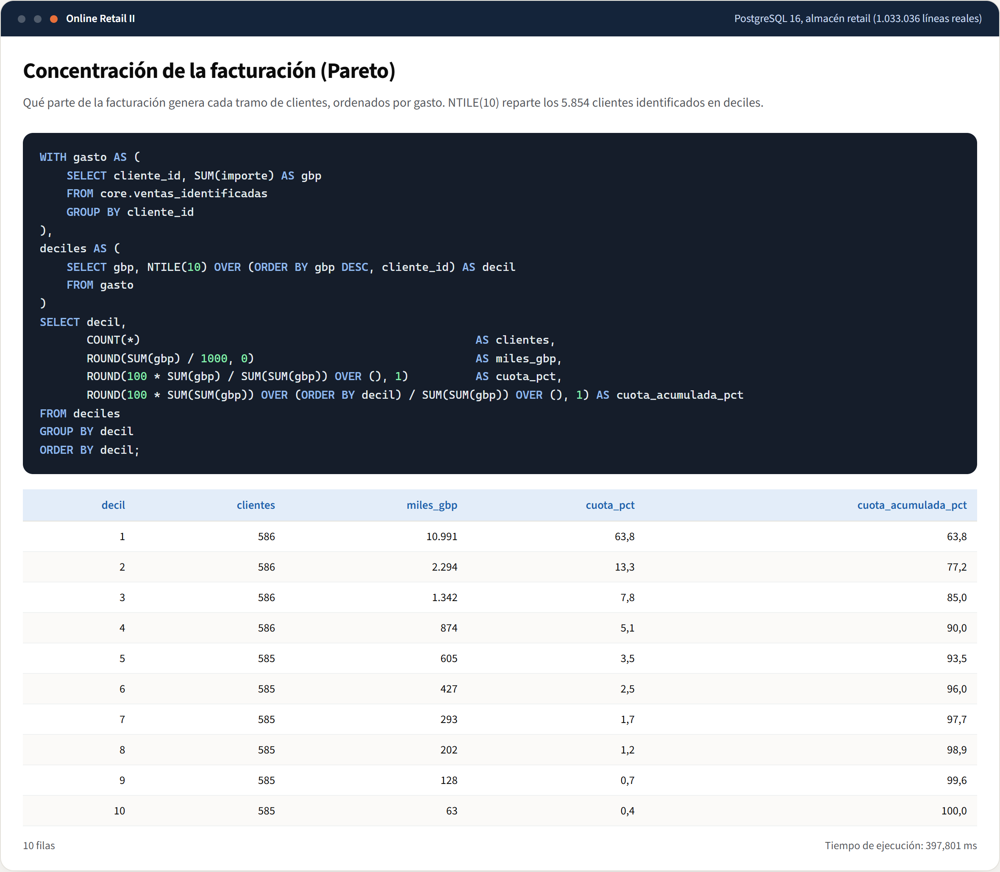

### 4. Segmentos RFM
[`04-segmentos-rfm.sql`](database/queries/04-segmentos-rfm.sql): la segmentación publicada en `mart.rfm`.

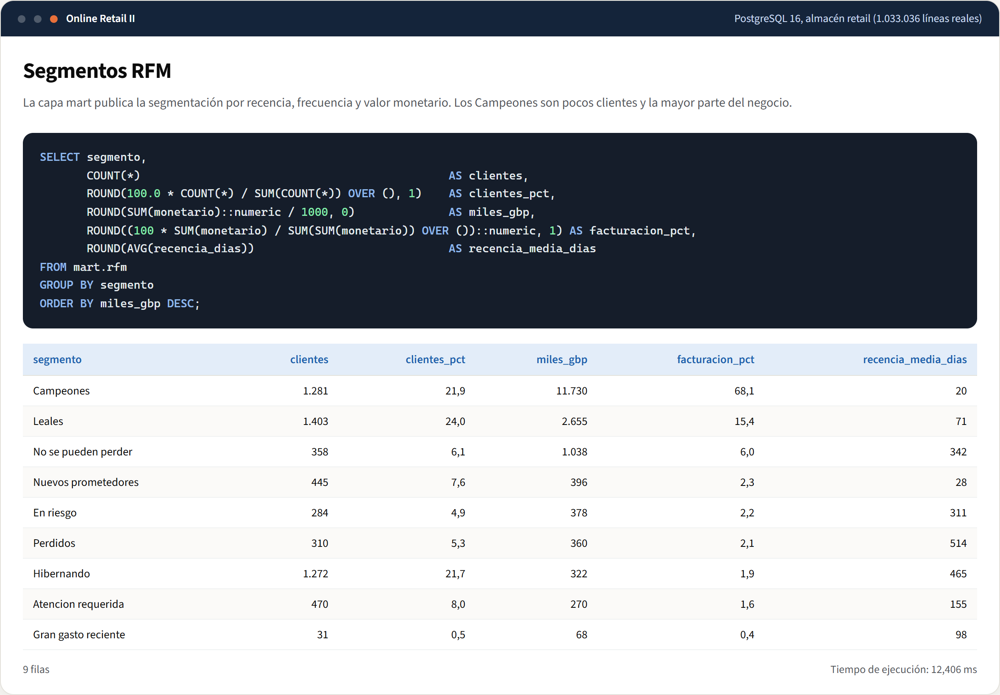

### 5. Cohortes
[`05-cohortes.sql`](database/queries/05-cohortes.sql): `FILTER` pivota los meses en columnas.

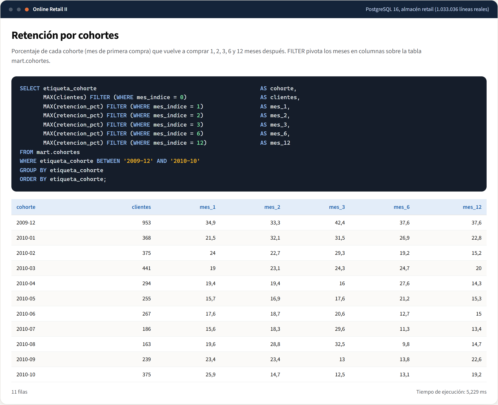

### 6. Productos que se compran juntos
[`06-cesta.sql`](database/queries/06-cesta.sql): confianza y lift del análisis de cesta.

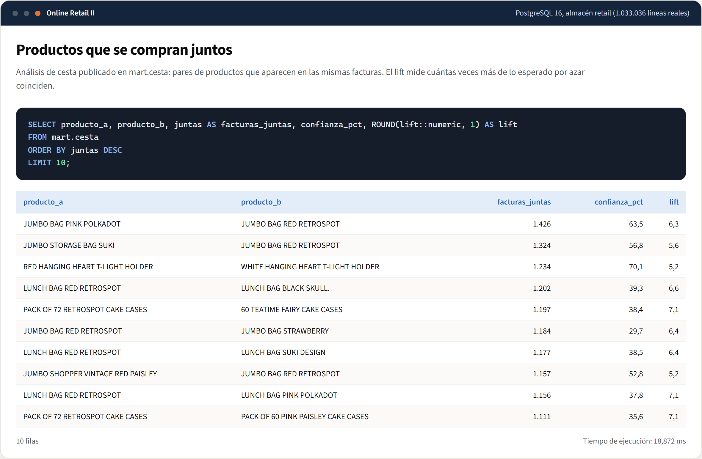

### 7. Mercados por región
[`07-mercados.sql`](database/queries/07-mercados.sql): ventas y devoluciones en una pasada con `FILTER`.

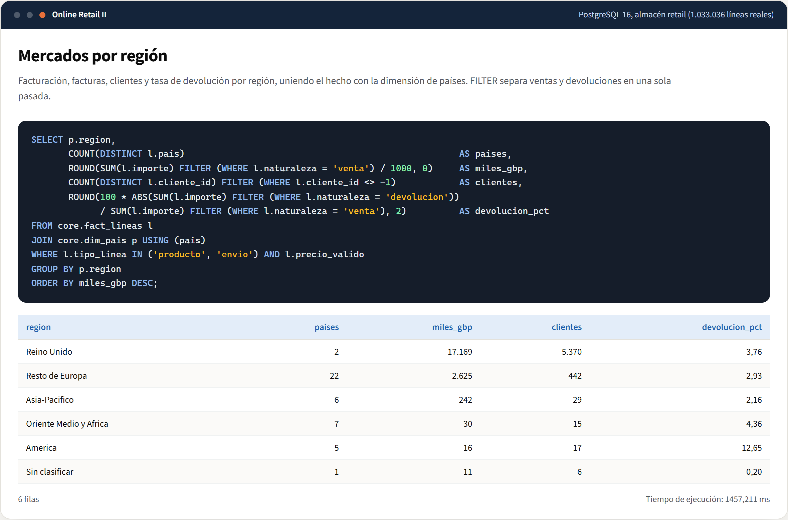

### 8. Las restricciones protegen el almacén
[`08-restricciones.sql`](database/queries/08-restricciones.sql): una línea hacia un producto inexistente se rechaza por clave foránea.

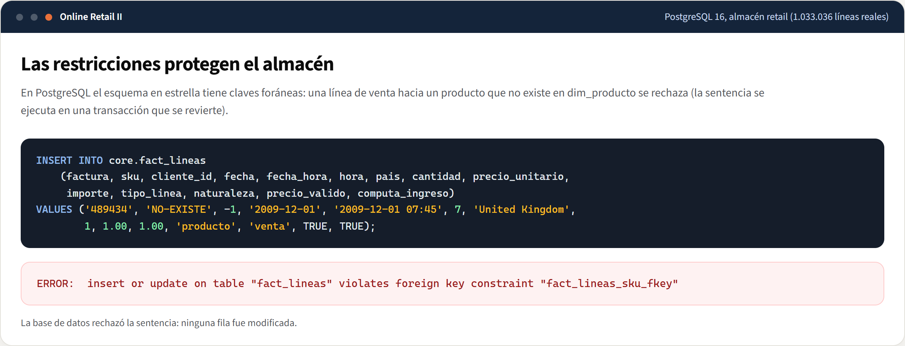

### 9. Plan de ejecución
[`09-plan-de-ejecucion.sql`](database/queries/09-plan-de-ejecucion.sql): el índice parcial localiza las 222 líneas de un cliente entre el millón.

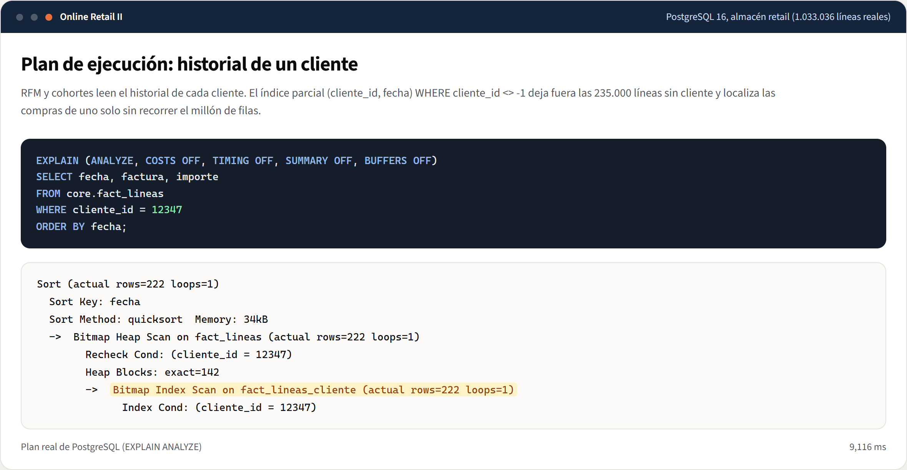

### 10. Tablas del almacén
[`10-tablas.sql`](database/queries/10-tablas.sql): filas y tamaño en disco.

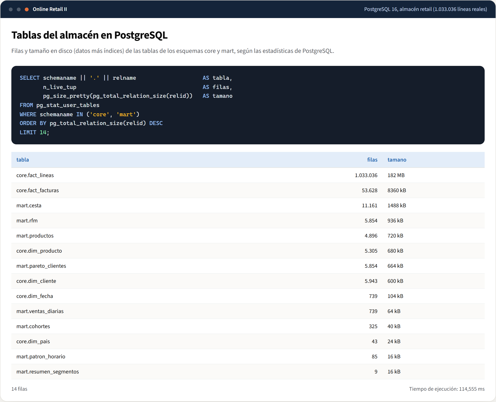

## Cómo reproducir las consultas

Con el almacén publicado (ver *Puesta en marcha* en el README):

```bash
psql "$DATABASE_URL" -f docs/database/queries/03-pareto-de-clientes.sql
```

O con Docker: `docker compose exec -T postgres psql -U retail -d retail < docs/database/queries/03-pareto-de-clientes.sql`.
